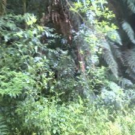

# Invasive Species Monitoring

Implementation of GoogLeNet architecture with Inception modules and Ensemble of Inception V3, Xception, ResNet50 using transfer learning to detect invasive hydrangea in Brazilian national forest images dataset from Kaggle.

Programmed in Keras using TensorFlow backend.

Made this project for participating in Kaggle competition Invasive Species Monitoring. Find details about the competition [here](https://www.kaggle.com/c/invasive-species-monitoring)

### Prerequisites
Python, TensorFlow, Keras (and other libraries such as NumPy, etc.). If using GPU for training, you will need an NVIDIA GPU card with software packages such as CUDA Toolkit 8.0 and cuDNN v5.1. See [here](https://www.tensorflow.org/install/install_linux) for more details.

Download the dataset from [here](https://www.kaggle.com/c/invasive-species-monitoring/data).

## Input
Input are various 1154x866 resolution RGB images (three channels), along with label corresponding to whether the image has presence of the invasive species hydrangea. Please create a folder 'input' and paste all the data files in the input folder. I have not uploaded the input folder with the data files on GitHub.

### Sample Images

Invasive species Hydrangea present

Invasive species not present

## Results
Achieved 0.977 and 0.987 area under ROC curve with GoogleNet and the ensemble respectively. Including Batch Normalization and Dropout layers after some Convolution layers in GoogleNet drastically increased the accuracy and overcame the problem of only one class being predicted for all examples.

### References and Acknowledgments
1] Kaggle Competition, Invasive Species Monitoring, Identify images of invasive hydrangea. Link [here](https://www.kaggle.com/c/invasive-species-monitoring)

2] Szegedy, C., Liu, W., Jia, Y., Sermanet, P., Reed, S., Anguelov, D., ... & Rabinovich, A. (2015). Going deeper with convolutions. In Proceedings of the IEEE conference on computer vision and pattern recognition (pp. 1-9).

3] https://gist.github.com/joelouismarino/a2ede9ab3928f999575423b9887abd14

[4] https://www.analyticsvidhya.com/blog/2017/06/transfer-learning-the-art-of-fine-tuning-a-pre-trained-model/
